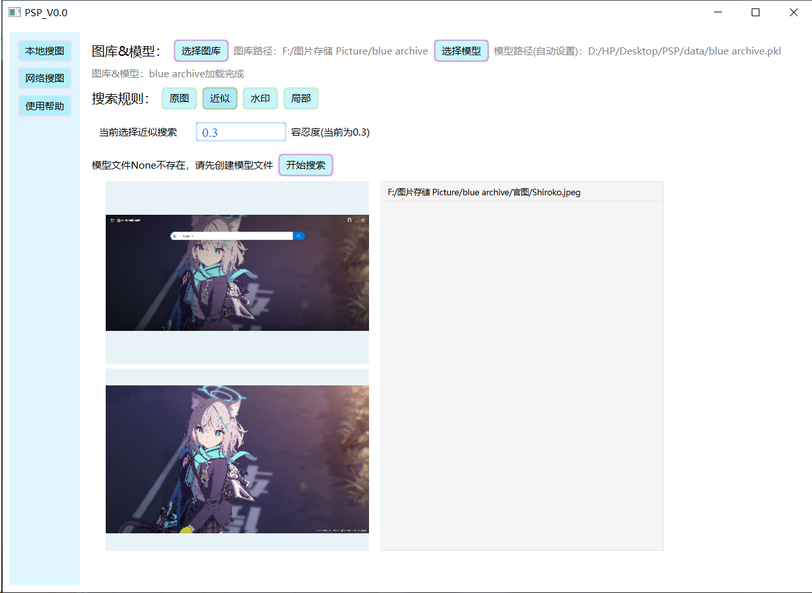

## 1.项目功能
- 本项目**PSP**(PicSearchPic)是支持**CLI/GUI**双模式的**以图搜图**工具。
- 目前计划开发**网络**图片搜索(暂时搁置)与**本地**图片搜索(完成了一半)两个功能。
- 本项目中，一般用`local`代表本地图片，`input`代表输入图片。
- 已验证过的支持的图片格式：`.jpg`、`.jpeg`、`.png`。


## 2.快速开始

### 2.1 Quick Start --- python

`git clone https://github.com/virtualxiaoman/PSP.git`
然后配置环境（下面两个方法二选一），请将路径改为自己的虚拟环境地址：
```bash
python -m venv "G:\venv\torch_venv"
"G:\venv\torch_venv\Scripts\activate"
pip install numpy scipy matplotlib pillow opencv-python imagehash, pandas
```
```bash
conda create --prefix "G:\conda\torch_conda" python=3.11 -y
conda activate "G:\conda\torch_conda"
conda install numpy scipy matplotlib pillow opencv imagehash -c conda-forge
```

然后运行：
```python
import time

from Tools.read_pic import read_image, read_images, imgs2df
from Tools.pic_util import HashPic
from Tools.search_pic import SP

path_origin = '../search/阿洛娜_原图.jpg'
path_similar = '../search/阿洛娜_水印_重复.jpg'
img_origin = read_image(path_origin, gray_pic=False, show_details=False)
img_similar = read_image(path_similar, gray_pic=False, show_details=False)

start_time = time.time()
sp = SP()
sp.init_pic_df(path_local='../input')
ans = sp.search_origin(img_origin)
print(ans)
ans = sp.search_similar(img_similar)
print(ans)
end_time = time.time()
elapsed_time = end_time - start_time
print("总时间： {:.2f} 秒".format(elapsed_time))
```

预期输出应该类似于：
```
G:\venv\torch_venv\Scripts\python.exe E:\py_proj\picspic\Tools\quick_start.py 
[init_pic_df] ../assets/input.pkl无模型文件，正在重新生成
[imgs2df] 已处理第 4/4 张图片
[imgs2df] dataframe已全部保存到../assets/input.pkl
[imgs2df] 总耗时: 0.09 秒, 每张图片耗时: 0.0232 秒
[init_pic_df] 从../assets/input.pkl初始化dataframe完成
['E:/py_proj/picspic/input/阿洛娜/arona.jpg']
['E:/py_proj/picspic/input/阿洛娜/arona.jpg']
总时间： 0.14 秒
进程已结束，退出代码为 0
```

### 2.2 Quick Start --- GUI：
<div align="center">
    
</div>
左上图是剪贴板里自动获取的待搜索的图片，左下图是搜索结果预览图，右侧列表是搜索结果。操作不难就不逐步介绍了。


## 3.功能展示

注意：本部分功能在线程实现前测的，线程实现后速度会更快，只需要原先大约1/5的时间。

**示例：**
本地图库有365张，106 MB。初始化图库数据： 15.57 秒

-------原图`local`--------------------原图`input`--------------------近似图片`input`-------
<div>
    
    
    
</div>
----------------------------------------查原图：0.09秒----------------查近似：0.03秒

（查原图慢一些的原因是：需要更精确的匹配，也就是逐像素点匹配）


**注意：**
1. 目前就是**初始化图库数据**(模型文件)比较慢，后续会优化。（估计开个多线程？）
对于我本地的一个`15.3 GB(5443张图)`的图库，初始化用时`638.60秒`，生成的模型大小`1.7 MB`，查询只需要`0.25秒`。
（注：目前已经提速到**15.7 GB(5603张图)128.40秒, 0.023秒/图**）
另外中文路径的似乎一直比英文的慢，暂时不知道原因，可能是编码问题吧。

2. 暂时**不支持动态更新**模型，以后再加上。

3. **构建方法**：`pyinstaller -F --noconsole --icon=UI/data/arona.ico UI/ui.py`。如果上面的报错，就改为`pyinstaller -F --noconsole --icon=UI/data/arona.ico UI/ui.py -p E:/Py-Project/PSP`，其中`-p`后面是你的项目路径，使用`-p`的作用是将项目路径加入到`sys.path`中，这样就可以找到自定义的模块了。

注：25.6.27测试为[imgs2df] 总耗时: 518.78 秒, 每张图片耗时: 0.0928 秒（15.7 GB ，5,610张图）

## 4.进度
#### 3.1 本地图片搜索
- [x] 精确搜索
- [x] 模糊搜索
- [ ] 局部搜索
- [ ] 优化搜索算法、使用~VGG16~等深度学习模型（可以看docx文档里面有一些思路）
#### 3.2 网络图片搜索
- [ ] 网络图片搜索
#### 3.3 GUI
- [x] 图形化界面