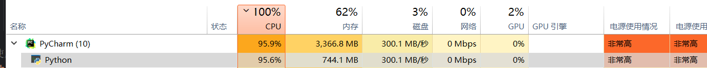

主要是原图搜索与近似图片搜索。

# 1. 综述
无论是那种方法都需要先减小搜索域，然后再进行具体的搜索。

## 1.1 更新历史

- 2024-7-2: 项目启动
- 2024-7-7: 实现ori, sim搜索，见于`e4fdafee9d6d0edfbc3209e329c8c76ecf5b14fa`的[仓库](https://github.com/virtualxiaoman/PSP/tree/e4fdafee9d6d0edfbc3209e329c8c76ecf5b14fa)
- 2024-7-21: 重构代码，优化搜索逻辑，见于`0b665e40331fad47366cdd0d69f6e079528d90f2`的[仓库](https://github.com/virtualxiaoman/PSP/tree/0b665e40331fad47366cdd0d69f6e079528d90f2)
- 2024-7-22: 完成UI界面，见于`c2bce91fb8fe9d1ff5925087f3ee0b9b0adca1b6`的[仓库](https://github.com/virtualxiaoman/PSP/tree/c2bce91fb8fe9d1ff5925087f3ee0b9b0adca1b6)
- 2025-2-15: 中途摆烂了很久，这次主要优化了初始化速度，从原先的`15.3 GB(5443张图)638.60秒`提速到`15.7 GB(5603张图)128.40秒, 0.023秒/图`，具体方法见3.2。

# 2. 整体流程

构建的data如下，以第一条数据为例（因为开的多线程所以第一条的size很小也是符合预期的）：

| id | path | hash                     | size | shape | mean | 25p                 |
|----|------|--------------------------|------|-------|------|---------------------|
| 0 | F:/Picture/pixiv/100306908_p0.jpg | [True, True, False,... ] | 1417065 | (845, 559, 3) | 211.902221 | [165, 189, 186,...] |


## 2.1 原图搜索


## 2.2 近似图片搜索


# 3.减小搜索域
## 3.1 全局特征提取
### 3.1.1 机器学习方法
1. phash


### 3.1.2 深度学习方法
1. DINOv2

https://huggingface.co/facebook/dinov2-base
https://blog.csdn.net/qq_43692950/article/details/144770970


# 4. 优化

## 4.1 删除了的特征

根据运行时间，删除了std特征，某次运行时间如下（注意这仍是单线程）：

```python
# 注释是运行时间，以365张BA的图为例：
# read_image是9.076秒，get_image_info是13.849秒，imgs2df合计26.117秒
data.append({
    'id': len(data),
    'path': file_path,
    'hash': hash_value,  # 365    0.056    0.000    1.770    0.005 __init__.py:260(phash)
    'size': size,
    'shape': shape,
    'mean': mean,  # 730    0.003    0.000    1.611    0.002 fromnumeric.py:3385(mean)
    # 'std': std,  # 365    0.002    0.000   10.589    0.029 fromnumeric.py:3513(std)，时间太长不要了
    '25p': pixel_25p  # 365    1.653    0.005    1.653    0.005 {resize}
})
```

并且根据实际使用，'25p'这个特征很难起到作用，所以删除了。


## 4.2 构建速度加快

CPU基本跑满了，暂时没想到更好的方法



虽然GPT说：
多线程读取图片（I/O密集型）
使用 ThreadPoolExecutor 提交所有图片读取任务，并在每个图片读取完成后立即将其提交给后续处理。
多进程计算图片信息（CPU密集型）
使用 ProcessPoolExecutor 对每张已读取的图片计算hash和其它图像信息。这样可以让图片读取和计算并行执行，缩短整体耗时。
但暂时只使用了多线程，在我电脑上跑的多线程已经把CPU跑满了。


